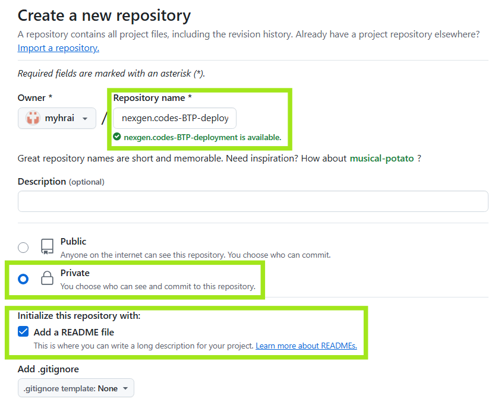
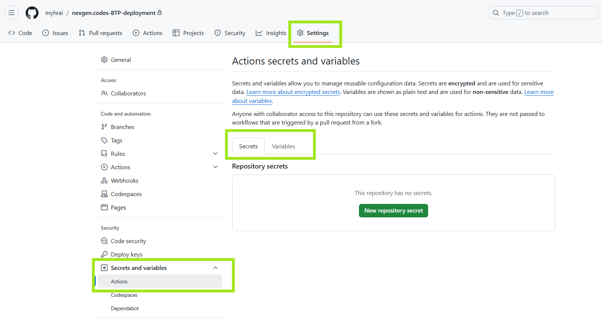
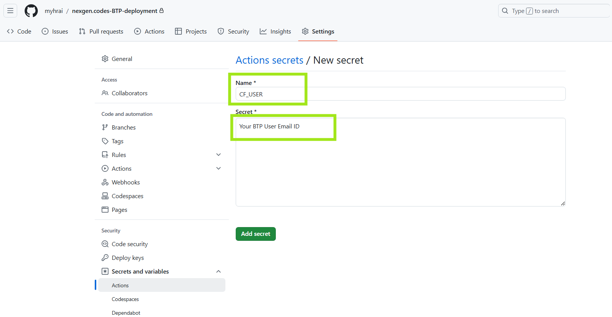
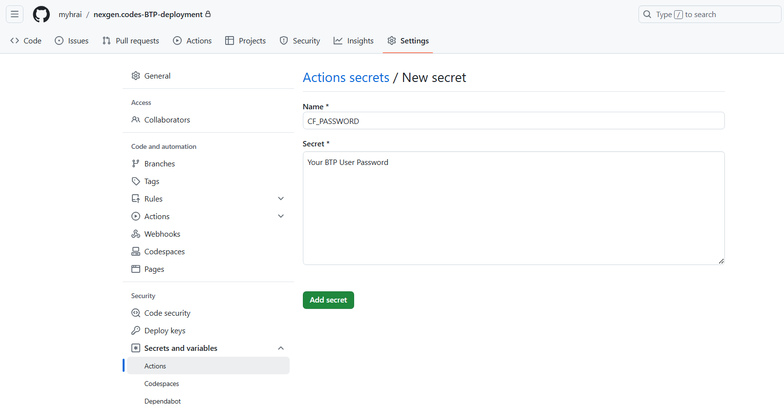
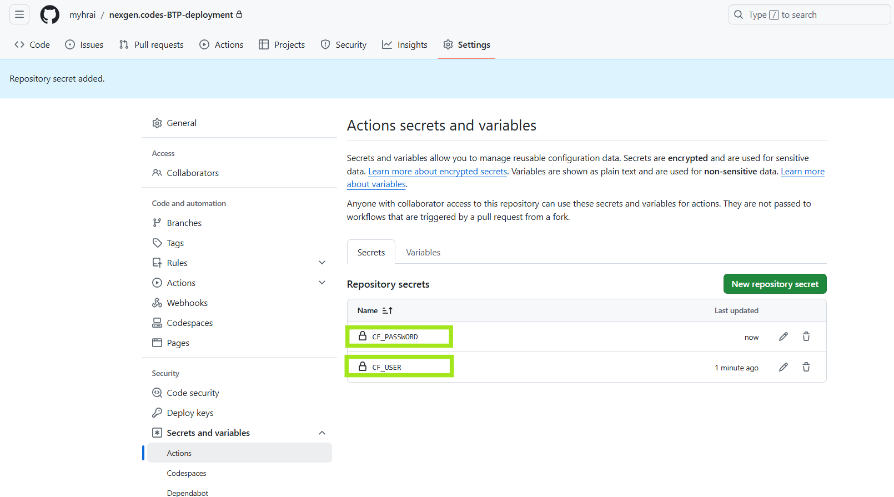
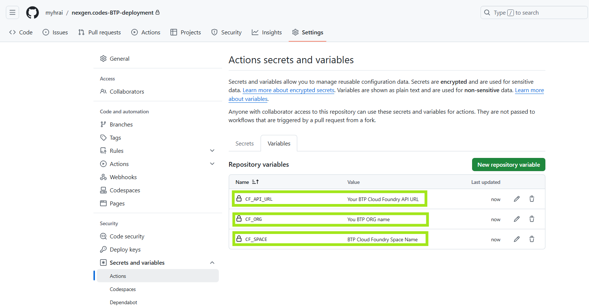
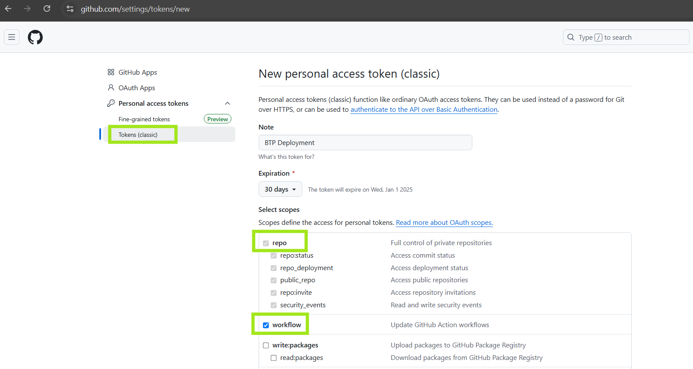
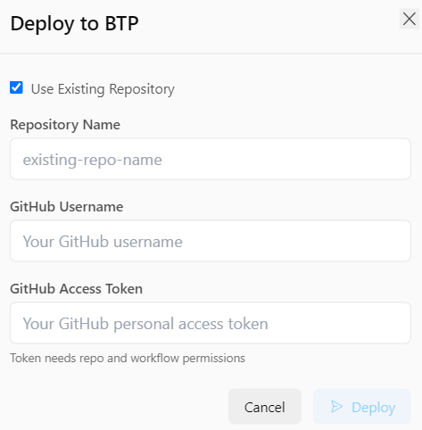

# BTP Deployment Guide

## 1. Create a Private GitHub Repo with README.md

## 2. Configure the BTP credentials in your private GitHub repo:

### Add Secrects (BTP Credentials)

### Add Variables (BTP Connection Details)

## 3. Generate GitHub Access Token:

## 4. NexGen.codes BTP Deployment:

