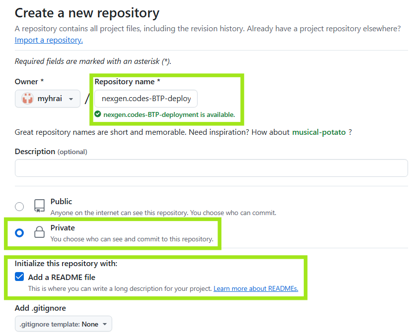

# BTP Deployment Guide

## Create a Private GitHub Repo with README.md

## Configure the BTP credentials in your private GitHub repo:

## Generate GitHub Access Token:

## NexGen.codes BTP Deployment:

